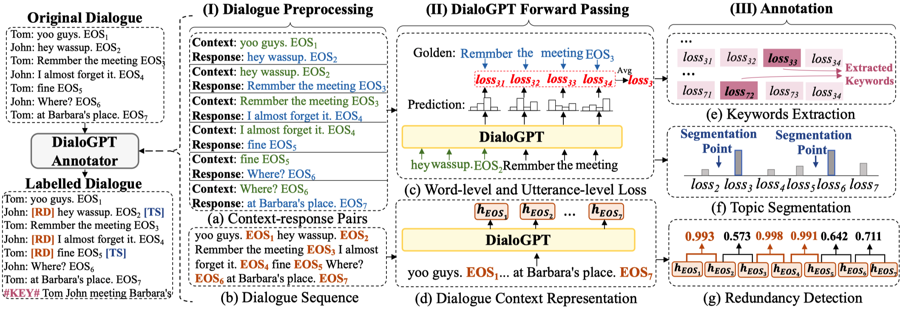

# PLM as an Annotator

This is the **Pytorch** code for our **ACL21** paper **Language Model as an Annotator: Exploring DialoGPT for Dialogue Summarization** [arXiv](https://arxiv.org/abs/2105.12544).

  

## Outputs
Output summaries are available at [SAMSum](https://github.com/xcfcode/PLM_annotator/blob/main/bart/summaries/samsum.txt) and [AMI](https://github.com/xcfcode/PLM_annotator/blob/main/pgn/summaries/ami.txt).

## Codes

* For SAMSum dataset, please refer to the **[bart](https://github.com/xcfcode/PLM_annotator/tree/main/bart)** directory.
* For AMI dataset, please refer to the **[pgn](https://github.com/xcfcode/PLM_annotator/tree/main/pgn)** directory.